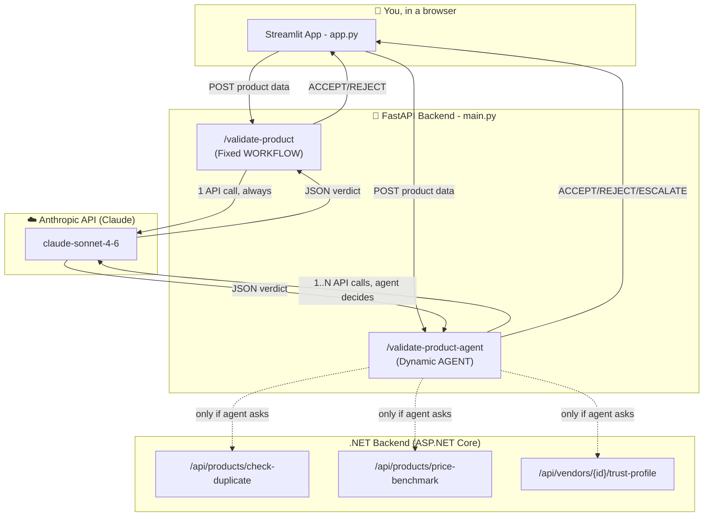
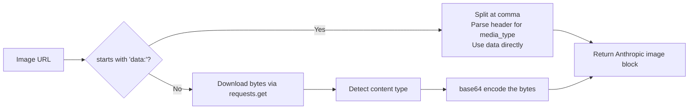
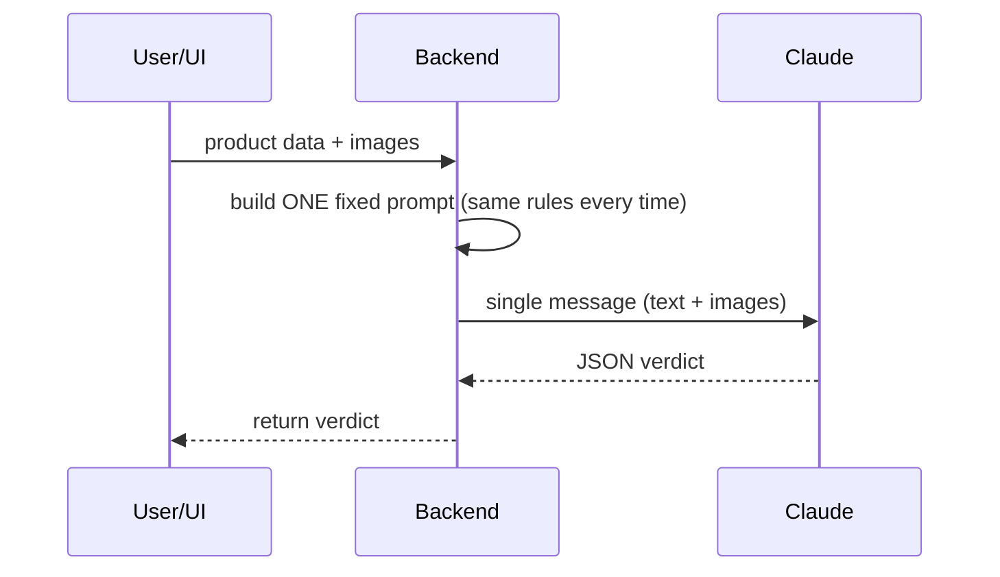
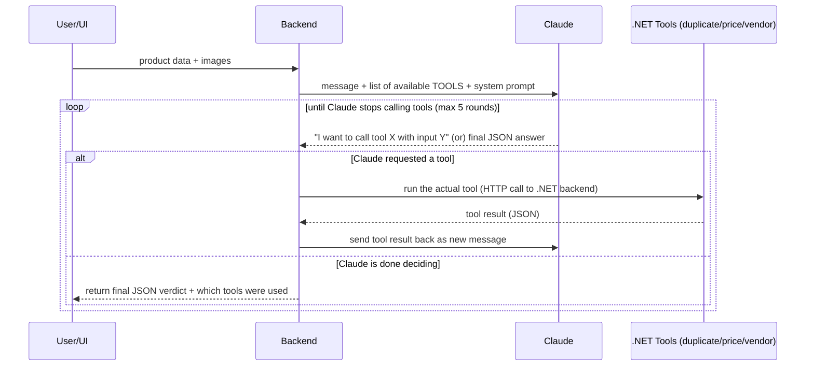

# 🛒 Product Validation Service — Complete Guide (Workflow vs Agent)

This project has **two Python files** and does **one job**: look at a product listing
(name, description, category, images...) and decide: **ACCEPT**, **REJECT**, or **ESCALATE** it.

It does this job **two different ways**, side by side, so you can compare them:

| File | What it is | Analogy |
|---|---|---|
| `main.py` | The **brain** — a FastAPI backend with 4 endpoints | The kitchen where food is cooked |
| `app.py` | The **face** — a Streamlit UI you click buttons on | The dining room where you order food |

This README explains **every single concept**, starting from zero, then walks through
**every function**, then explains the **core difference** (Workflow vs Agent) with diagrams.

---

## Table of Contents

1. [The Absolute Basics](#1-the-absolute-basics)
2. [The Big Picture (System Diagram)](#2-the-big-picture-system-diagram)
3. [Part A: `main.py` — The Backend Brain](#3-part-a-mainpy--the-backend-brain)
4. [Part B: `app.py` — The Streamlit Frontend](#4-part-b-apppy--the-streamlit-frontend)
5. [Workflow vs Agent — The Core Concept](#5-workflow-vs-agent--the-core-concept)
6. [Step-by-Step: What Happens When You Click "Validate"](#6-step-by-step-what-happens-when-you-click-validate)
7. [Line-by-Line Concept Glossary](#7-line-by-line-concept-glossary)
8. [How to Run This Project](#8-how-to-run-this-project)

---

## 1. The Absolute Basics

Before touching the code, let's define every big word used in this project, like you're
hearing them for the first time.

- **API (Application Programming Interface)**: A way for two programs to talk to each
  other, like a restaurant menu. You (the customer/program) don't go into the kitchen —
  you just say "I want item #4" and get a plate back. Here, our FastAPI backend is a
  "menu" with 4 items (endpoints) you can order.

- **Endpoint**: One specific "menu item" on an API. Example: `/validate-product` is an
  endpoint. You send it data, it sends data back.

- **HTTP POST request**: One way of "ordering." You package up data (JSON) and send it
  to an address (URL). The server processes it and replies.

- **JSON (JavaScript Object Notation)**: A universal way to write structured data as
  text, like:
  ```json
  { "name": "Shoe", "price": 19.99, "colors": ["red", "blue"] }
  ```
  Both Python and JavaScript (and almost every language) can read/write this easily.

- **FastAPI**: A Python library/framework for building APIs. You write normal Python
  functions, put a decorator like `@app.post("/validate-product")` on top, and FastAPI
  turns it into a live web server endpoint.

- **Streamlit**: A Python library for building simple web *user interfaces* (buttons,
  text boxes, sliders) without writing any HTML/CSS/JavaScript. `app.py` uses this.

- **Pydantic `BaseModel`**: A way to describe "the shape of data I expect," e.g. "a
  product must have a `name` (text) and a `price` (number)." FastAPI uses this to
  automatically validate incoming JSON and reject bad data before your code even runs.

- **LLM (Large Language Model)**: The AI model itself — here it's **Claude**
  (`claude-sonnet-4-6`), reached via the **Anthropic API**. It reads text + images and
  writes text back.

- **Multimodal**: Means the AI can understand more than one type of input — here, both
  **text** (the product description) and **images** (photos of the product) at once.

- **Base64 encoding**: A way to turn binary data (like an image file's raw bytes) into
  plain text, so it can be safely embedded inside a JSON message. Images can't be sent
  as raw binary inside JSON — base64 is the "translation" step.

- **Environment variable / `.env` file / `load_dotenv()`**: A way to store secrets (like
  API keys) *outside* your code, in a separate file, so you never accidentally commit
  passwords to GitHub. `load_dotenv()` reads that file into the program at startup.

- **Azure Key Vault**: A cloud "safe" for secrets. Instead of `.env` on your laptop, in
  production the API key can be pulled securely from Azure's vault.

- **Tool calling / Function calling**: A feature where you tell the AI "here are some
  functions you're *allowed* to call if you need extra information," and the AI decides
  **for itself**, mid-conversation, whether to call them. This is the heart of the
  "Agent" half of this project.

---

## 2. The Big Picture (System Diagram)



**In plain words:**
1. You fill a form in the Streamlit app.
2. It sends that form as JSON to the FastAPI backend.
3. The backend forwards your text + images to Claude.
4. Claude replies with a verdict (JSON).
5. The backend hands that verdict back to Streamlit, which displays it nicely.

The interesting part is **step 3 → 4** — that's where "Workflow" and "Agent" diverge.

---

## 3. Part A: `main.py` — The Backend Brain

### 3.1 Setup section (top of the file)

```python
from fastapi import FastAPI
from pydantic import BaseModel
import requests, os, json, base64, mimetypes
from azure.identity import DefaultAzureCredential
from azure.keyvault.secrets import SecretClient
from dotenv import load_dotenv

load_dotenv()
app = FastAPI()
```

- `load_dotenv()` reads a local `.env` file (if present) and loads values like
  `ANTHROPIC_API_KEY=sk-xxxx` into the program's environment — so secrets aren't
  hardcoded in the file.
- `app = FastAPI()` creates the actual web server object. Every `@app.post(...)`
  later attaches a new "menu item" (endpoint) to this server.

### 3.2 `load_secret()` — Getting the API key safely

```python
def load_secret(name: str, fallback_env: str = None) -> str:
    if KEY_VAULT_NAME:
        vault_url = f"https://{KEY_VAULT_NAME}.vault.azure.net"
        credential = DefaultAzureCredential()
        client = SecretClient(vault_url=vault_url, credential=credential)
        return client.get_secret(name).value
    if fallback_env:
        return os.getenv(fallback_env, "")
    return ""
```

**What it does, step by step:**
1. Checks: "Do we have a `KeyVaultName` configured (i.e. are we running in Azure)?"
2. **If yes** → connects to Azure Key Vault using `DefaultAzureCredential()` (this
   automatically figures out *how* to authenticate — Managed Identity in the cloud, or
   your local Azure CLI login on your laptop) and fetches the secret by name.
3. **If no** (e.g. you're developing locally) → falls back to reading a plain
   environment variable (from the `.env` file) instead.

This is a really nice pattern: **the same code works both locally and in the cloud**,
without `if` statements scattered everywhere else in the file.

### 3.3 Image handling — `image_url_to_base64_block()`

This is one of the trickiest functions, so let's go very slowly.

**The problem it solves:** Claude's API needs images sent as **base64 text data**, not
as a plain link (`https://...`). The comment in the code explains *why*:

> the Presidio LLM gateway proxy this service is currently pointed at does not support
> the "url" image source type — it requires images to be sent as base64 data.

So this function takes **any** image URL and converts it into the exact JSON shape
Claude's API expects:
```json
{
  "type": "image",
  "source": { "type": "base64", "media_type": "image/jpeg", "data": "iVBORw0K..." }
}
```

**It handles TWO different input cases:**

**Case 1 — the input is already a `data:` URI** (i.e. already base64-encoded, like
`data:image/png;base64,iVBORw0K...`):
```python
if url.startswith("data:"):
    header, encoded = url.split(",", 1)
    media_type = header.split(":", 1)[1].split(";")[0] or "image/jpeg"
```
- Splits the string at the first comma: everything before is the "header"
  (`data:image/png;base64`), everything after is the actual encoded data.
- Pulls the media type (`image/png`) out of the header text.
- No network request needed — it's already encoded, just repackage it.

**Case 2 — the input is a normal web link** (e.g. `https://images.unsplash.com/...`):
```python
resp = requests.get(url, timeout=15)
resp.raise_for_status()
content_type = resp.headers.get("Content-Type")
...
encoded = base64.b64encode(resp.content).decode("utf-8")
```
- **Downloads** the actual image bytes from the internet (`requests.get`).
- `raise_for_status()` — if the download failed (404, etc.), this throws an error
  immediately instead of silently continuing with broken data.
- Figures out the image's MIME type (`image/jpeg`, `image/png`...) either from the
  server's response headers, or by guessing from the file extension if the server
  didn't say.
- `base64.b64encode(...)` — turns the raw image bytes into base64 text so it can travel
  safely inside JSON.



### 3.4 The shared data models

```python
class ProductValidationRequest(BaseModel):
    name: str
    description: str
    category: str
    subCategory: str
    imageUrls: List[str]
    vendorId: Optional[str] = None
    price: Optional[float] = None
```

This is Pydantic doing "data shape enforcement." If someone sends a request missing
`name`, FastAPI **automatically rejects it** with a clear error — your function body
never even has to check "did they send a name?" manually.

`Optional[str] = None` means: this field is allowed to be missing. That's why the
**same model** works for both the Workflow endpoints (which ignore `vendorId`/`price`)
and the Agent endpoints (which use them).

There's a second model, `ProductVariantValidationRequest`, for validating a specific
*variant* of a product (like "Red, Size L" of a T-shirt) rather than the base product.
It works identically, just with extra `attributes` (a list of name/value pairs like
`Color: Red`).

---

## 4. Part B: `app.py` — The Streamlit Frontend

This file has **no AI logic at all** — its only job is to be a nice control panel that
sends requests to `main.py` and displays the results. Let's go top to bottom.

```python
st.set_page_config(page_title="Product Validation: Workflow vs Agent", layout="wide")
```
Sets the browser tab title and makes the page use the full screen width.

```python
with st.sidebar:
    api_base = st.text_input("API base URL", value="http://localhost:8000")
    mode = st.radio("Which endpoint(s) to call", [...])
```
Creates a **sidebar** (a panel on the left) with:
- A text box for the backend's address (so you could point it at a deployed Azure URL
  instead of localhost).
- Radio buttons letting you choose: call both endpoints, just the workflow, or just the
  agent.

```python
name = st.text_input("Product name", value="Wireless Bluetooth Earbuds")
...
image_urls = [u.strip() for u in image_urls_raw.splitlines() if u.strip()]
```
Builds the actual form: text boxes, a number box for price, and a multi-line text area
for image URLs. That last line takes the raw multi-line text box content, splits it
into separate lines, strips extra whitespace, and throws away any blank lines — turning
one big text blob into a clean Python list of URLs.

```python
run = st.button("🚀 Validate", type="primary", use_container_width=True)
```
This renders a button. Streamlit's model: **the whole script re-runs top-to-bottom every
time you interact with anything.** `run` is `True` only during the run that happens
right after you click it.

### `call_endpoint()` — the actual network call

```python
def call_endpoint(path: str, payload: dict):
    try:
        resp = requests.post(f"{api_base}{path}", json=payload, timeout=90)
        resp.raise_for_status()
        return resp.json(), None
    except Exception as e:
        return None, str(e)
```
Sends the form data as JSON to `main.py`, waits up to 90 seconds (image + AI calls can
be slow), and returns either `(result, None)` on success or `(None, error_message)` on
failure. This "return a tuple, never raise" pattern is why the calling code never needs
a `try/except` of its own — it just checks `if error:`.

### `render_result()` — displaying one verdict nicely

Walks through the JSON verdict and turns it into UI:
- Colors the recommendation green (ACCEPT), red (REJECT), or orange (ESCALATE).
- Draws a progress bar for the confidence score (0–100 → 0.0–1.0 for `st.progress`).
- Lists each flagged issue as a bullet point.
- **Only if `toolsUsed` exists in the response** (meaning: this was an Agent response,
  not a Workflow one) — shows which tools the agent decided to call, or explicitly says
  "none — decided the listing was clear enough on its own." This is a nice touch: it
  makes the Agent's *decision-making* visible to you, not just its final answer.
- Puts the full raw JSON in a collapsible expander for debugging.

### The final `if run:` block

Depending on which radio button you picked, it calls one or both endpoints (`Both`
mode puts them **side by side in two columns** so you can visually compare a Workflow
verdict against an Agent verdict for the exact same listing).

---

## 5. Workflow vs Agent — The Core Concept

This is the actual point of the whole project, so let's slow way down here.

### 5.1 The Workflow approach (`/validate-product`)



- **Always exactly one call to Claude.**
- The prompt (`build_workflow_prompt`) is a **fixed template** — the same 4 rules, every
  single time, for every product. Only the product's specific data changes.
- Claude cannot ask any follow-up questions or check anything external. It must decide
  using *only* what's in front of it: the text + the images.
- This is fast, predictable, and cheap (1 API call = 1 cost).
- **Weakness**: if the listing is *ambiguous* — e.g. price looks suspiciously low, or
  the vendor has a history of scams, or this exact same fake listing has been submitted
  five times before — the Workflow model has **no way to find that out**. It can only
  judge what's visually/textually in front of it.

### 5.2 The Agent approach (`/validate-product-agent`)



- **The number of Claude calls is NOT fixed** — it could be 1 (if Claude decides it
  doesn't need any tools) or up to 5 rounds (`max_turns=5`).
- Claude is given a **system prompt** describing its job, plus a `TOOLS` list — each
  tool has a `name`, a `description` (this description is literally how Claude *decides
  when* to use it — well-written descriptions matter a lot here), and an `input_schema`
  (the shape of arguments the tool needs).
- On each round, Claude's response has a `stop_reason`. If it's `"tool_use"`, Claude is
  asking to run one or more tools instead of giving a final answer yet.
- The backend then actually **executes** the real tool (a real HTTP call to the .NET
  backend, e.g. checking if this vendor has been flagged before), and sends the *result*
  of that tool call back to Claude as a new message.
- Claude reads the tool result and decides: "Do I have enough now?" or "let me check one
  more thing." This can repeat.
- Eventually Claude replies with **plain text** (`stop_reason` is no longer
  `"tool_use"`) — that's the final verdict, which gets parsed as JSON.
- Because ambiguity is now allowed to be *investigated*, the Agent can return a third
  option the Workflow can't: **`ESCALATE`** — "I'm not confident enough, a human should
  look at this."

### 5.3 Side-by-side comparison table

| Aspect | Workflow (`/validate-product`) | Agent (`/validate-product-agent`) |
|---|---|---|
| Number of AI calls | Always exactly 1 | 1 to 5 (dynamic) |
| Can look up extra data? | ❌ No | ✅ Yes (3 tools: duplicate check, price anomaly, vendor trust) |
| Decision options | ACCEPT / REJECT | ACCEPT / REJECT / **ESCALATE** |
| Speed | Fast, constant | Variable — slower when it investigates |
| Cost | Fixed, low | Variable, can be higher |
| Predictability | High — same input basically always follows same path | Lower — behavior depends on the model's judgment call |
| Best for | Simple, clear-cut listings | Borderline/ambiguous listings where more context changes the answer |

### 5.4 The three Agent tools, explained

1. **`check_duplicate_product`** — "Has this exact product already been listed?" Useful
   when a listing looks generic or copy-pasted, hinting it might be a duplicate/spam
   resubmission.
2. **`check_price_anomaly`** — "Is this price way off from the category average?" Useful
   for catching scams (too cheap = probably fake/counterfeit) or catching mispricing
   errors (too expensive for what's shown).
3. **`get_vendor_trust_profile`** — "Does this vendor have a track record of getting
   listings rejected?" Useful as a tie-breaker: the *same* borderline listing might
   deserve more suspicion from a vendor who's been rejected a lot before, versus a
   trusted long-time vendor.

Each tool function (e.g. `check_duplicate_product(...)`) simply calls a real endpoint on
the ASP.NET Core backend (`BACKEND_BASE_URL`) and returns the JSON result — or an
`{"error": ...}` dict if that backend call fails, so one broken tool doesn't crash the
whole agent loop.

### 5.5 `extract_json_object()` — a small but important safety net

LLMs sometimes wrap their JSON answer in explanations or markdown fences even when told
not to. This function:
1. Strips ` ``` ` fences if present.
2. Finds the first `{`.
3. Walks forward character by character, **counting `{` and `}` depth**, until the
   braces balance back to zero — that's the exact end of the JSON object, even if there
   were extra sentences *after* it.
4. Tries to `json.loads()` just that substring.

This is more robust than a naive "just look for the first and last curly brace" approach
because it correctly handles nested objects/arrays inside the JSON.

---

## 6. Step-by-Step: What Happens When You Click "Validate"

Picking **"Both (compare)"** mode as the fullest example:

1. You fill the form and click **🚀 Validate**.
2. Streamlit reruns the script; `run` becomes `True`.
3. It builds one `payload` dict from all the form fields.
4. It calls `call_endpoint("/validate-product", payload)` **and**
   `call_endpoint("/validate-product-agent", payload)`.
5. For the **Workflow** call:
   - `main.py` builds the fixed prompt text.
   - Downloads/encodes each image URL into a base64 block.
   - Sends ONE message to Claude.
   - Parses the JSON reply, returns it.
6. For the **Agent** call:
   - `main.py` builds a shorter prompt (just the facts) plus the system prompt and tool
     definitions.
   - Sends the first message to Claude.
   - If Claude asks for tools, executes them against the .NET backend and loops.
   - Once Claude gives a final plain-text JSON answer, parses and returns it (with
     `toolsUsed` attached).
7. Streamlit receives both results and renders them **side by side** — same product,
   two different reasoning processes, so you can literally see where they agree or
   disagree.

---

## 7. Line-by-Line Concept Glossary

| Term / Code | Meaning |
|---|---|
| `@app.post("/path")` | FastAPI decorator: "run this function when someone POSTs to this URL" |
| `resp.raise_for_status()` | Throws an exception if the HTTP response was an error (4xx/5xx) |
| `timeout=90` | Give up waiting after 90 seconds, instead of hanging forever |
| `DefaultAzureCredential()` | Auto-detects the best way to authenticate to Azure (managed identity, CLI login, etc.) |
| `st.session_state` (not used here, but common in Streamlit) | Would persist values between reruns — this app avoids needing it by keeping everything in one linear script |
| `stop_reason == "tool_use"` | Claude's signal that it wants to call a tool instead of answering yet |
| `messages.append({"role": "assistant", ...})` | Standard chat-API pattern: you must echo the model's own turn back into the conversation history before sending tool results, or the next call loses context |
| `max_turns=5` | A safety cap so a confused agent can't loop forever burning API calls |
| `Optional[str] = None` | Pydantic syntax for "this field may be omitted from the request" |

---

## 8. How to Run This Project

**Prerequisites:** Python 3.10+, an Anthropic API key, and (for the Agent's tools to
actually return real data) the ASP.NET Core backend running too.

```bash
# 1. Install dependencies for the backend
uv pip install fastapi uvicorn requests python-dotenv azure-identity azure-keyvault-secrets pydantic

# 2. Create a .env file next to main.py:
echo "ANTHROPIC_API_KEY=sk-ant-xxxxxxxx" >> .env
echo "BackendBaseUrl=http://localhost:5000" >> .env

# 3. Start the backend
uvicorn main:app --reload --port 8000

# 4. In a second terminal, install and run the Streamlit UI
uv pip install streamlit
streamlit run app.py
```

Then open the Streamlit URL it prints (usually `http://localhost:8501`), fill in a
product, and click **Validate** — try both "Workflow only" and "Agent only" on the same
listing to see the difference in behavior firsthand.